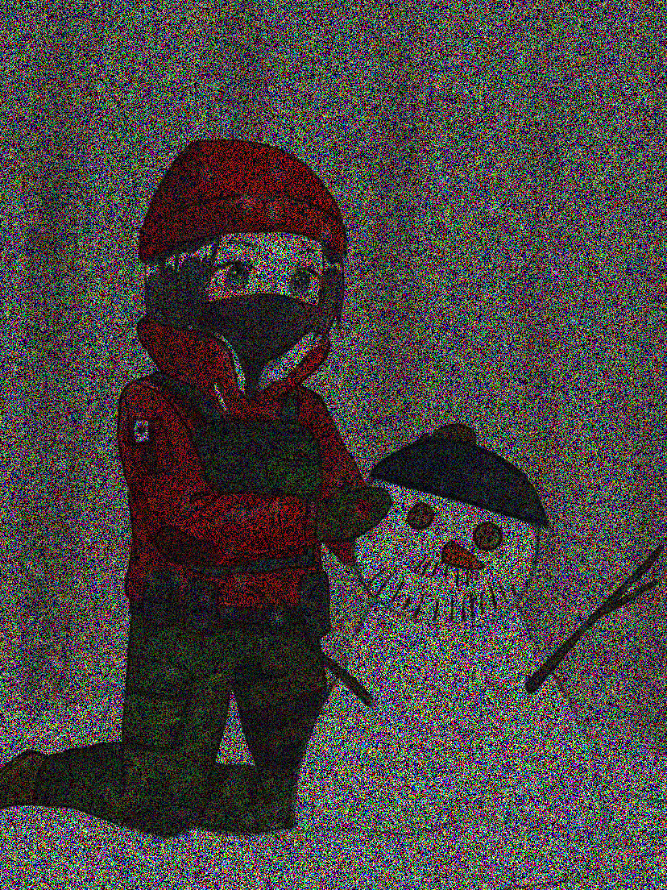

# color image denoising using sklearn
first orgin image:     
     
then using noise_image_generate.py to add noise :        
      
then using LinearRegression to recovery the image:           
      
code is in image_restore.py
